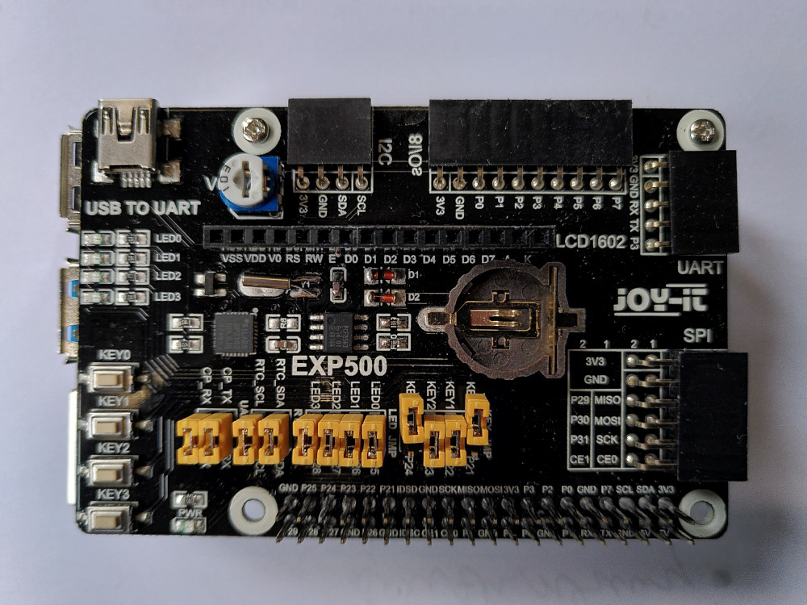

# Spóznawanje rěče - digidom

Přikład z Raspberry Pi 4.

Za tutón přikład trjebaće přidatnje:
* "EXPLORER 500": https://joy-it.net/de/products/RB-EXP500
* "Respeaker 4 Mic Array": https://wiki.seeedstudio.com/ReSpeaker_4_Mic_Array_for_Raspberry_Pi/
* (fakultatiwne) "ReSpeaker USB Mic Array": https://wiki.seeedstudio.com/ReSpeaker-USB-Mic-Array/
    * zajimawa alternatiwa, kiž funguje lěpje, hdyž ma rěčnik wulki wotstawk abo hdyž je wulki pódlanski šum

Prošu změńće jumpery na EXP500 kaž na tutym wobrazu:



# Software

KEDŹBU! 64 bit hišće njefunguje, prošu zapisajće

* arm_64bit=0

do wašu "/boot/config.txt" a startujeće system znowa!


Sćěhowaca software dyrbi so instalować:

* docker
* docker-compose

Tule nawod za to:

```console
git clone https://github.com/ZalozbaDev/raspberry_pi_demo_spoznawanje.git
```

Zakładny container twariće sej takle (hlej tež započatk "Dockerfile"):

```console
docker build -t digidom_spoznawanje .
```

Container wuwjedźeće tak:

```console
# wužiwajo "Respeaker 4 Mic Array"
docker-compose -f docker-compose-respeaker.yml up -d

# wužiwajo "ReSpeaker USB Mic Array"
docker-compose -f docker-compose-usb-respeaker.yml up -d
```

# Přiměrjenje

Za přiměrjenje funkcijow, abo zatwar nowych funkcijow su změny we tutych datajach trěbne: 

* "inputs/corpus/smartlamp_base.corp"
    * słowa kóždeje sady so awtomatisce zapisaja do fonetiskeho leksikona
* "inputs/uasr_grammar/digidom.txt"
    * nawod namakaće tule: https://zalozbadev.github.io/UASR/manual/automatic/tools/REC_PACKDATA.xtp.html#dlg_dlgfiles
* "scripts/reaction.sh"
    * tu so napisa, kak ma prototyp reagować, jeli je komando spóznał

Po tym container prošu znowa twarić.
    
# Licenca

Hlej dataja "LICENSE".

