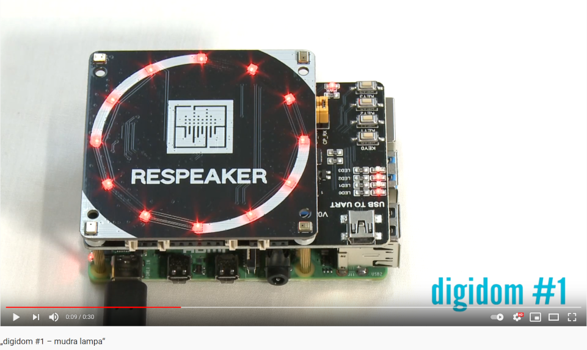

# Spóznawanje rěče - digidom

Přikład z Raspberry Pi 4.

[](http://www.youtube.com/watch?v=nV3dtDJF6hw "digidom #1")

Za tutón přikład trjeba so přidatne:
* "EXPLORER 500": https://joy-it.net/de/products/RB-EXP500
* "Respeaker 4 Mic Array": https://wiki.seeedstudio.com/ReSpeaker_4_Mic_Array_for_Raspberry_Pi/

Prošu změniće jumpery na EXP500 kaž na tutym wobrazu:


# Software

Sćěhowaca software dyrbi so instalować:

* docker
* docker-compose

Container twariće na přikład tak:

```console
docker build -t raspberry_pi_demo_spoznawanje .
```

Container wuwjesće tak:

```console
docker-compose up -d
```

# Licenca

Hlej dataja "LICENSE".
